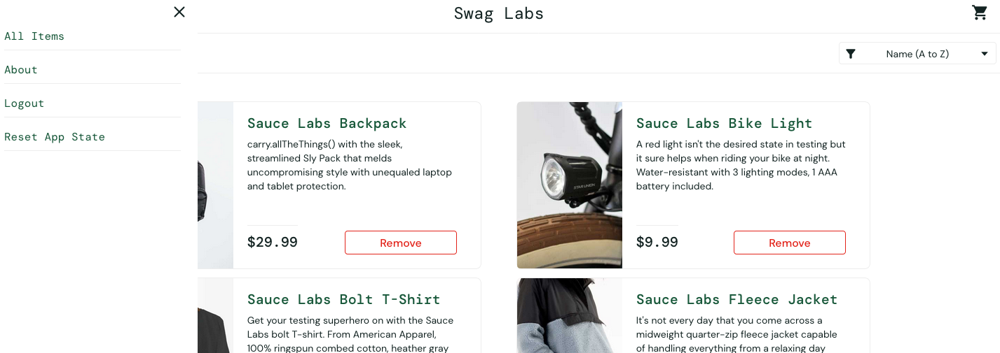
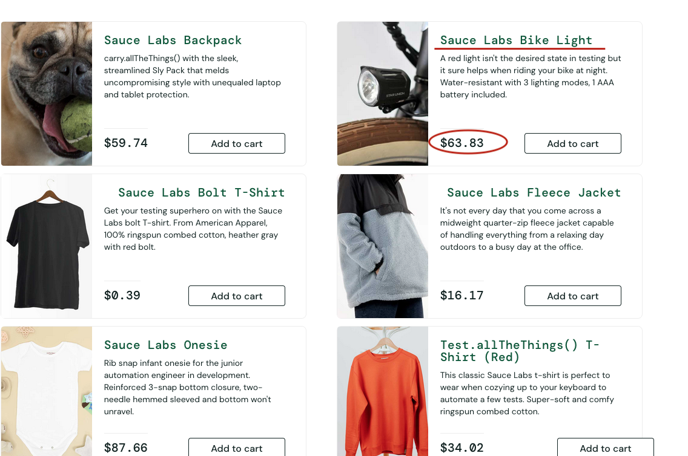
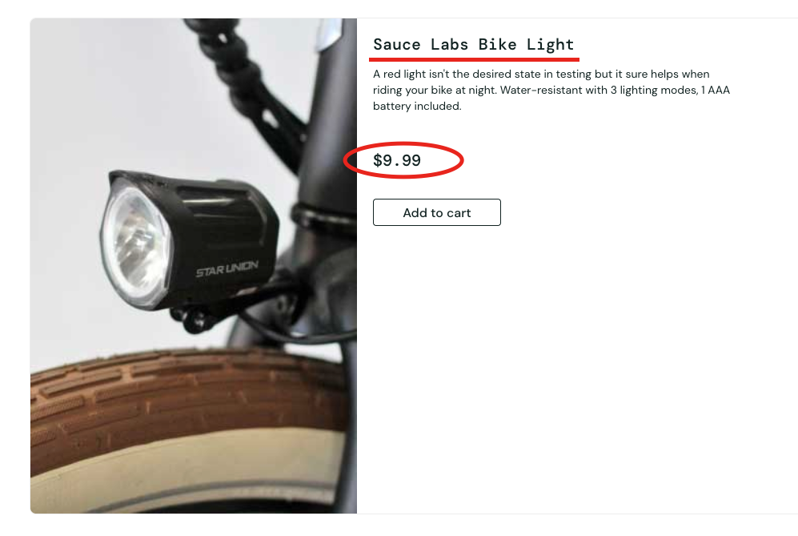

# BUGREPORT-1.MD 

A list of bugs found during testing.

## 1: Reset app state does not reset 'Add to cart' buttons

**priority**: low

1. login as standard user
2. add at 1+ products to the shopping cart
3. open menu to reset app state
4. view shopping cart is cleared

**expect**: all app data to be cleared and app is restored to starting state

**actual**: all the products that were added from the list still have "Remove", instead of "Add to cart". Their respective app states have not been successfully reset

**workaround**: refresh page at this point to correct the Remove button states

## 2: incorrect image preview for backpack

**priority**: medium

1. login as visual user
2. view image preview for Sauce Labs Backpack

**expect**: same image for preview and product page to be shown

**actual**: image for backpack in inventory page is different than the one shown on inventory item page

## 3: product prices are not consistent across pages

**priority**: high

1. login as visual user
2. observe the price of 'Bike Light' inventory page
3. select Bike Light and observe displayed price

**expect**: prices shown on inventory page are the same as those shown on inventory item pages

**actual**: product prices for all products differ between inventory & inventory item pages

## 4: checkout details last name input is broken

**priority**: high

**expect**: entering values into the 3 fields should produce consistent & typical behaviour

**actual**: entering values into last name input overwrites the value for first name 